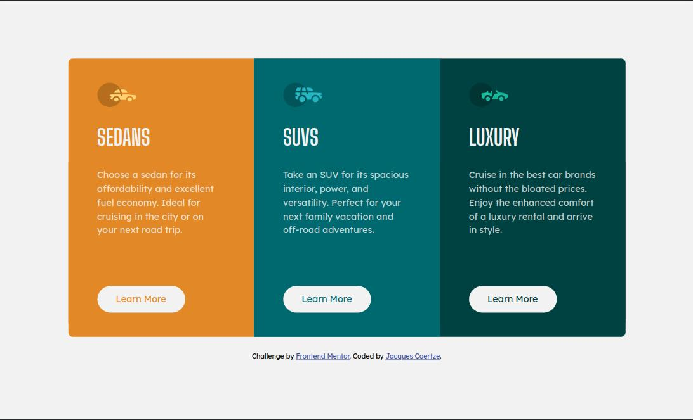

# Frontend Mentor - 3-column preview card component solution

This is a solution to the [3-column preview card component challenge on Frontend Mentor](https://www.frontendmentor.io/challenges/3column-preview-card-component-pH92eAR2-). Frontend Mentor challenges help you improve your coding skills by building realistic projects.

## Table of contents

- [Overview](#overview)
  - [The challenge](#the-challenge)
  - [Screenshot](#screenshot)
  - [Links](#links)
- [My process](#my-process)
  - [Built with](#built-with)
  - [Useful resources](#useful-resources)
- [Author](#author)
- [Acknowledgments](#acknowledgments)

## Overview

### The challenge

Users should be able to:

- View the optimal layout depending on their device's screen size
- See hover and focus states for interactive elements

### Screenshots

#### Desktop Version

#### Mobile Version

### Links

- Solution URL: [https://github.com/Tripex48/FEM_3-column-preview-card-component](https://github.com/Tripex48/FEM_3-column-preview-card-component)
- Live Site URL: [https://Tripex48.github.io/FEM_3-column-preview-card-component](https://Tripex48.github.io/FEM_3-column-preview-card-component)

## My process

### Built with

- Semantic HTML5 markup
- CSS custom properties
- Flexbox
- Mobile-first workflow

### Useful resources

- [CSS reset](https://piccalil.li/blog/a-modern-css-reset/) - A great modern CSS reset that ensures a clean (default) start to any web development project.
- [Learn flexbox the easy way](https://www.youtube.com/watch?v=u044iM9xsWU) - A video from Kevin Powell discussing the properties and workings of CSS Flexbox.
- [Stylelint](https://stylelint.io/) - A mighty, modern linter that helps you avoid errors and enforce conventions in your styles.
- [Autoprefixer]() - [PostCSS](https://github.com/postcss/postcss) plugin to parse CSS and add vendor prefixes to CSS rules using values from [Can I Use](https://caniuse.com/).

## Author

- Frontend Mentor - [@Tripex48](https://www.frontendmentor.io/profile/Tripex48)
- Twitter - [@jcoertze](https://www.twitter.com/jcoertze)

## Acknowledgments

Thank you to FrontEnd Mentor for providing this challenge.
